# RAMP Core ER Diagram v2.0

## 目的

このER図は、RAMP Core MVPを「支援サイクル」ではなく、まず **福祉事業所の骨格・責務・文脈・時間軸** から捉え直すための設計図である。

RAMPは単なる記録ソフトではない。

RAMPは、

* 法人
* 事業所
* 職員
* 職務
* 利用者
* 契約サービス
* 支援計画
* 日報
* モニタリング
* ケース会議
* 意思決定ログ
* 監査ログ

を一つの時間軸で接続し、福祉事業所における **関係性・責務・意思決定・観測可能性** を管理する業務OSである。

---

## 業務ER図（RAMP Core MVP v2.0）

```mermaid
erDiagram
    CORPORATIONS ||--o{ OFFICES : "運営する"
    OFFICES ||--o{ OFFICE_SERVICE_CONFIGURATIONS : "提供サービス"
    SERVICE_TYPES ||--o{ OFFICE_SERVICE_CONFIGURATIONS : "サービス種別"

    OFFICES ||--o{ USERS : "所属利用者"
    USERS ||--|| USER_PII : "PIIを分離"
    USERS ||--o| USER_PROFILES : "支援プロフィール"
    USERS ||--o{ SERVICE_CERTIFICATES : "受給者証履歴"

    USERS ||--o{ USER_SERVICE_CONTRACTS : "契約サービス"
    OFFICE_SERVICE_CONFIGURATIONS ||--o{ USER_SERVICE_CONTRACTS : "契約対象サービス"

    SUPPORTERS ||--|| SUPPORTER_PII : "職員PII"
    CORPORATIONS ||--o{ SUPPORTERS : "所属職員"
    OFFICES ||--o{ SUPPORTER_OFFICE_ASSIGNMENTS : "職員配置"
    SUPPORTERS ||--o{ SUPPORTER_OFFICE_ASSIGNMENTS : "勤務・所属履歴"

    SUPPORTERS ||--o{ SUPPORTER_JOB_ASSIGNMENTS : "職務割当"
    ROLE_MASTERS ||--o{ SUPPORTER_JOB_ASSIGNMENTS : "職務・ロール"
    OFFICES ||--o{ SUPPORTER_JOB_ASSIGNMENTS : "事業所文脈"
    CORPORATIONS ||--o{ SUPPORTER_JOB_ASSIGNMENTS : "法人文脈"

    USERS ||--o{ USER_SUPPORTER_ASSIGNMENTS : "担当者履歴"
    SUPPORTERS ||--o{ USER_SUPPORTER_ASSIGNMENTS : "担当する"
    ROLE_MASTERS ||--o{ USER_SUPPORTER_ASSIGNMENTS : "担当職務"

    USERS ||--o{ SUPPORT_PLANS : "個別支援計画"
    USER_SERVICE_CONTRACTS ||--o{ SUPPORT_PLANS : "契約サービスに基づく計画"
    SUPPORT_PLANS ||--o{ LONG_TERM_GOALS : "長期目標"
    LONG_TERM_GOALS ||--o{ SHORT_TERM_GOALS : "短期目標"
    SHORT_TERM_GOALS ||--o{ INDIVIDUAL_SUPPORT_GOALS : "個別支援目標"

    USERS ||--o{ USER_DAILY_LOGS : "作業日報"
    USER_SERVICE_CONTRACTS ||--o{ USER_DAILY_LOGS : "利用契約に基づく記録"
    USERS ||--o{ SUPPORT_RECORDS : "支援記録"
    USER_SERVICE_CONTRACTS ||--o{ SUPPORT_RECORDS : "利用契約に基づく支援"
    INDIVIDUAL_SUPPORT_GOALS ||--o{ SUPPORT_RECORDS : "目標に紐づく支援"
    SUPPORTERS ||--o{ SUPPORT_RECORDS : "支援実施者"

    SUPPORT_PLANS ||--o{ MONITORING_REPORTS : "モニタリング"
    SUPPORTERS ||--o{ MONITORING_REPORTS : "実施者"

    USERS ||--o{ CASE_CONFERENCE_LOGS : "ケース会議"
    SUPPORT_PLANS ||--o{ CASE_CONFERENCE_LOGS : "計画に関する会議"
    CASE_CONFERENCE_LOGS ||--o{ CASE_CONFERENCE_PARTICIPANTS : "参加者"
    SUPPORTERS ||--o{ CASE_CONFERENCE_LOGS : "主催者"

    USERS ||--o{ ATTENDANCE_RECORDS : "出欠実績"
    USER_SERVICE_CONTRACTS ||--o{ ATTENDANCE_RECORDS : "契約サービス単位の出欠"

    USER_DAILY_LOGS ||--o| ABSENCE_RESPONSE_LOGS : "欠席時対応"
    SUPPORT_PLANS ||--o{ ABSENCE_RESPONSE_LOGS : "計画に基づく対応"

    USERS ||--o{ BILLING_DATA : "請求根拠"
    USER_SERVICE_CONTRACTS ||--o{ BILLING_DATA : "契約根拠"
    SUPPORT_PLANS ||--o{ BILLING_DATA : "計画根拠"
    USER_DAILY_LOGS ||--o| BILLING_DATA : "日報根拠"

    SUPPORTERS ||--o{ DECISION_LOGS : "意思決定者"
    USERS ||--o{ DECISION_LOGS : "対象利用者"
    SUPPORT_PLANS ||--o{ DECISION_LOGS : "計画判断"
    CASE_CONFERENCE_LOGS ||--o{ DECISION_LOGS : "会議判断"

    SUPPORTERS ||--o{ AUDIT_ACTION_LOGS : "操作主体"
    USERS ||--o{ AUDIT_ACTION_LOGS : "対象利用者"
    SUPPORTERS ||--o{ UNRESOLVED_RISK_COUNTERS : "対応担当"
```



---

## 中核エンティティ一覧

| Entity                     | Table                           | 役割                                    |
| -------------------------- | ------------------------------- | ------------------------------------- |
| Corporation                | `corporations`                  | 法人。RAMP世界の最上位組織単位。                    |
| Office                     | `offices`                       | 事業所。支援・職員配置・利用契約の実行単位。                |
| ServiceType                | `service_types`                 | 就労移行、就労継続B型などのサービス種別マスタ。              |
| OfficeServiceConfiguration | `office_service_configurations` | 事業所が提供するサービス設定。定員・営業日・対象障害などを持つ。      |
| User                       | `users`                         | 利用者の業務上の核。PIIを持たない。                   |
| UserPII                    | `user_pii`                      | 氏名・住所・受給者証番号などの個人情報保管庫。               |
| UserProfile                | `user_profiles`                 | 利用者の支援プロフィール。                         |
| ServiceCertificate         | `service_certificates`          | 受給者証・支給決定情報の履歴。                       |
| UserServiceContract        | `user_service_contracts`        | 利用者がどの事業所サービスを契約しているか。                |
| Supporter                  | `supporters`                    | 職員・支援者の業務アカウント。                       |
| SupporterPII               | `supporter_pii`                 | 職員の個人情報。                              |
| SupporterOfficeAssignment  | `supporter_office_assignments`  | 職員がどの事業所に、いつ、どの勤務形態で所属するか。            |
| RoleMaster                 | `role_masters`                  | システム管理者、法人管理者、管理者、サビ管、支援員などの職務・ロール定義。 |
| SupporterJobAssignment     | `supporter_job_assignments`     | 職員に付与された職務・権限・文脈。CBACの中核。             |
| UserSupporterAssignment    | `user_supporter_assignments`    | 利用者と担当職員の関係履歴。担当サビ管などを表す。             |
| SupportPlan                | `support_plans`                 | 個別支援計画。支援サイクルの起点。                     |
| LongTermGoal               | `long_term_goals`               | 計画内の長期目標。                             |
| ShortTermGoal              | `short_term_goals`              | 長期目標に紐づく短期目標。                         |
| IndividualSupportGoal      | `individual_support_goals`      | 日々の支援活動と接続する最小目標単位。                   |
| UserDailyLog               | `user_daily_logs`               | 利用者の作業日報（体調・自己評価・生産活動等。1日1件）。 |
| SupportRecord              | `support_records`               | 支援員による個別支援記録（面談・送迎・ケース等。1日複数件）。|
| MonitoringReport           | `monitoring_reports`            | 計画の見直し・評価イベント。                        |
| CaseConferenceLog          | `case_conference_logs`          | ケース会議の記録。                             |
| CaseConferenceParticipant  | `case_conference_participants`  | ケース会議の参加者。職員・本人・家族・外部関係者を含む。          |
| AttendanceRecord           | `attendance_records`            | 出欠・通所実績。                              |
| AbsenceResponseLog         | `absence_response_logs`         | 欠席時対応記録。                              |
| BillingData                | `billing_data`                  | 請求根拠データ。MVPでは請求生成ではなく整合性チェックの基盤。      |
| DecisionLog                | `decision_logs`                 | なぜその判断をしたかを記録する意思決定ログ。                |
| AuditActionLog             | `audit_action_logs`             | 事実ベースの監査ログ。誰が何をしたか。                   |
| UnresolvedRiskCounter      | `unresolved_risk_counters`      | 未対応リスクの累積管理。評価ログ。                     |

---

## 支援サイクル上の意味

```text
Corporation
 ↓
Office
 ↓
OfficeServiceConfiguration
 ↓
UserServiceContract
 ↓
User
 ↓
SupportPlan
 ↓
UserDailyLog / SupportRecord
 ↓
MonitoringReport
 ↓
CaseConferenceLog
 ↓
SupportPlan の見直し
 ↓
DecisionLog / AuditActionLog / UnresolvedRiskCounter
```

この流れにより、RAMPは以下を保証する。

* 利用者がどの法人・事業所・サービス文脈に属しているかが明確になる
* 職員がどの立場で操作しているかが明確になる
* 日報が計画・契約サービス・支援目標と切り離されない
* モニタリングが特定の計画に対する評価として残る
* ケース会議が計画変更や支援方針変更の根拠になる
* 意思決定の理由がDecisionLogとして残る
* 監査ログは事実を記録する
* 未対応リスクは人ではなくリスクを主語にする

---

## 設計上の重要原則

### 1. 骨格が先、支援サイクルは後

RAMPでは、支援計画や日報より先に、以下の骨格が存在しなければならない。

```text
Corporation
 └─ Office
     └─ OfficeServiceConfiguration
         └─ UserServiceContract
```

この骨格があることで、支援記録は「誰に対する、どの事業所サービスの記録か」を失わない。

---

### 2. UserはPIIを持たない

`users` は業務上の利用者IDであり、氏名・住所・受給者証番号などは `user_pii` に分離する。

PIIの閲覧・編集・出力は、通常権限とは別のPII権限で管理する。

---

### 3. Supporterは職員本人、権限は文脈に宿る

`supporters` は職員本人を表す。

ただし、権限は職員本人に静的に付与されるものではない。

権限は、

```text
Supporter
 × RoleMaster
 × Corporation / Office
 × User
 × Period
```

の文脈によって成立する。

そのため、`supporter_job_assignments` と `user_supporter_assignments` はRAMPのCBACを支える中核テーブルである。

---

### 4. 支援計画は階層構造を持つ

```text
SupportPlan
 └─ LongTermGoal
     └─ ShortTermGoal
         └─ IndividualSupportGoal
```

日々の支援活動は `IndividualSupportGoal` に接続される。

---

### 5. UserDailyLogとSupportRecordを物理分離する

`user_daily_logs` は利用者による1日1件の作業日報（体調や自己評価など）。
`support_records` は支援員による支援ごとの個別支援記録。

これらを物理的に分離し、互いに依存しない設計とすることで、利用者が作業日報を提出していない日でも、支援員が個別の支援記録（面談、欠席連絡、家族対応など）を1日何件でも独立して登録可能にしている。

---

### 6. MonitoringReportはSupportPlanに紐づく

モニタリングは利用者単体ではなく、特定の計画に対する評価として管理する。

---

### 7. CaseConferenceParticipantは職員に限定しない

ケース会議の参加者は職員だけではない。

本人、家族、相談支援専門員、医療機関、企業担当者なども参加し得る。

そのため `case_conference_participants` は、職員IDだけに依存せず、参加者種別・氏名・所属・役割・本人同席フラグを持つ。

---

### 8. DecisionLogとAuditActionLogを分離する

* `DecisionLog` は意思決定の理由を記録する
* `AuditActionLog` は操作事実を記録する

例：

```text
AuditActionLog:
  田中が個別支援計画を承認した

DecisionLog:
  なぜ承認したのか
  なぜ遡及承認が必要だったのか
  なぜ本人不在でケース会議を実施したのか
```

RAMPは状態だけでなく、意思決定の理由をタイムラインとして残す。

---

### 9. AuditActionLogとUnresolvedRiskCounterを分離する

* `AuditActionLog` は事実の記録
* `UnresolvedRiskCounter` は未対応リスクの記録

監査ログは人を評価しない。
評価ログは人を断罪しない。

---

## MVP対象外だが将来接続する領域

以下はCore ER図では詳細展開しないが、将来的に接続する領域である。

* 就労先・定着支援
* 工賃・生産活動
* レセプト・請求出力
* チャット・コミュニケーション
* 苦情・事故・委員会・研修

なお、旧版でMVP対象外としていた「法人・事業所・サービス種別マスタ」は、v2.0ではCore MVPの骨格に昇格する。
