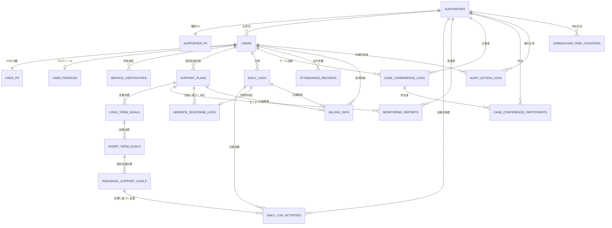

# RAMP Core ER Diagram v1.0

## 目的

このER図は、RAMP Core MVPの中核である「利用者 → 個別支援計画 → 日報 → モニタリング → ケース会議 → 管理確認事項」を、業務フローとデータ構造の両面から把握するための設計図です。

RAMPは単なる記録ソフトではなく、支援の質・監査耐性・組織学習を一体化する業務OSとして設計します。

---

## 業務ER図（RAMP Core MVP）



---

## 中核エンティティ一覧

| Entity | Table | 役割 |
|---|---|---|
| User | `users` | 利用者の業務上の核。PIIを持たない。 |
| UserPII | `user_pii` | 氏名・住所・受給者証番号などの個人情報保管庫。 |
| UserProfile | `user_profiles` | 利用者の支援プロフィール。 |
| ServiceCertificate | `service_certificates` | 受給者証・支給決定情報。 |
| Supporter | `supporters` | 職員・支援者の業務アカウント。 |
| SupporterPII | `supporter_pii` | 職員の個人情報。 |
| SupportPlan | `support_plans` | 個別支援計画。支援サイクルの起点。 |
| LongTermGoal | `long_term_goals` | 計画内の長期目標。 |
| ShortTermGoal | `short_term_goals` | 長期目標に紐づく短期目標。 |
| IndividualSupportGoal | `individual_support_goals` | 日々の支援活動と接続する最小目標単位。 |
| DailyLog | `daily_logs` | 1日単位の支援記録。 |
| DailyLogActivity | `daily_log_activities` | 日報内の具体的な支援活動。 |
| MonitoringReport | `monitoring_reports` | 計画の見直し・評価イベント。 |
| CaseConferenceLog | `case_conference_logs` | ケース会議の記録。 |
| CaseConferenceParticipant | `case_conference_participants` | ケース会議の参加職員。 |
| AttendanceRecord | `attendance_records` | 出欠・通所実績。 |
| BillingData | `billing_data` | 請求根拠データ。MVPでは請求生成ではなく整合性チェックの基盤。 |
| AuditActionLog | `audit_action_logs` | 事実ベースの監査ログ。誰が何をしたか。 |
| UnresolvedRiskCounter | `unresolved_risk_counters` | 未対応リスクの累積管理。評価ログ。 |

---

## 支援サイクル上の意味

```text
User
 ↓
SupportPlan
 ↓
DailyLog / DailyLogActivity
 ↓
MonitoringReport
 ↓
CaseConferenceLog
 ↓
SupportPlan の見直し
 ↓
AuditActionLog / UnresolvedRiskCounter
```

この流れにより、RAMPは以下を保証します。

- 計画が作りっぱなしにならない
- 日報が計画と切り離されない
- モニタリングが支援サイクルに接続される
- ケース会議が組織知として残る
- 監査ログは事実を記録する
- 未対応リスクは人ではなくリスクを主語にする

---

## 設計上の重要原則

### 1. UserはPIIを持たない

`users` は業務上の利用者IDであり、氏名・住所・受給者証番号などは `user_pii` に分離する。

### 2. 支援計画は階層構造を持つ

```text
SupportPlan
 └─ LongTermGoal
     └─ ShortTermGoal
         └─ IndividualSupportGoal
```

日々の支援活動は `IndividualSupportGoal` に接続される。

### 3. DailyLogとDailyLogActivityを分ける

`daily_logs` は1日の記録。  
`daily_log_activities` はその中の具体的な支援行為。

これにより、1日1件の日報に複数の支援活動を記録できる。

### 4. MonitoringReportはSupportPlanに紐づく

モニタリングは利用者単体ではなく、特定の計画に対する評価として管理する。

### 5. CaseConferenceParticipantを分離する

ケース会議は複数職員が参加するため、参加者を独立テーブルで管理する。

### 6. AuditActionLogとUnresolvedRiskCounterを分離する

- `AuditActionLog` は事実の記録
- `UnresolvedRiskCounter` は未対応リスクの記録

監査ログは人を評価しない。  
評価ログは人を断罪しない。

---

## MVP対象外だが将来接続する領域

以下はCore ER図では詳細展開しないが、将来的に接続する領域です。

- 就労先・定着支援
- 工賃・生産活動
- レセプト・請求出力
- チャット・コミュニケーション
- 苦情・事故・委員会・研修
- 法人・事業所・サービス種別マスタ

